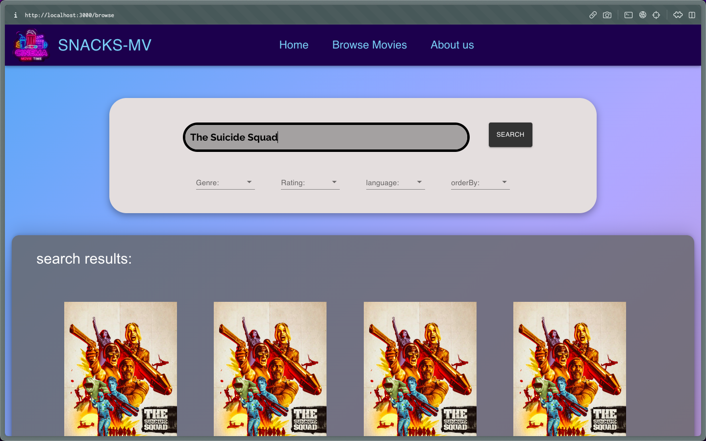

<p align="center">
	
</p>
<h1 align="center">
  Snacks-mv: Movie Browsing app
</h1>

<p align="center">
      
</p>

<p align="center">

</p>
<p align="center">
    <a href="https://memberpress.com/wp-content/uploads/2020/12/coming-soon-page.jpg" target="blank">View Demo</a>
    ·
    <a href="https://github.com/OmarMHawash/userpanel/issues/new">Report Bug</a>
    ·
    <a href="https://github.com/OmarMHawash/userpanel/issues/new">Request Feature</a>
</p>

#### Welcome to Snacks-mv, Movies discovery app built on MERN stack!

You can browse movies using our brosing page, with search filteration on different movie categories

<h2 id="demo"> 🚀 Demo </h2>


Checkout The Demo: [Live Demo](https://memberpress.com/wp-content/uploads/2020/12/coming-soon-page.jpg)

<h2 id="markdown-navigation"> 🧭 Markdown Navigation </h2>

- [Markdown Navigation](#markdown-navigation)
  - [Quick Start](#quick-start)
  - [Features](#features)
  - [Resources](#resources)
  - [Preview](#preview)
  - [What's New?](#changes)

<h2 id="quick-start">🛠️ Installation Steps </h2>

### \*pre-requisites

- have **Node** (v14) (doesn't work on newer versions) and **npm** correctly installed on your machine.
- **MongoDB** for database operation
- Spring Tool Suite or any IDE of your taste.

## Steps

1. Clone the repository

```bash
git clone https://github.com/OmarMHawash/MernProject.git
```

2. Change the working directory

```bash
cd MernProject
```

3. Install dependencies

```bash
npm install && npm start
```

<h2 id="features">🤯 Features & Functionalities </h2>

- browsing movies with various filtering categories
...
<h2 id="resources">💻 Technologies Used </h2>

- This project was bootstrapped with [Create React App](https://github.com/facebook/create-react-app). (v17)
- Used [Express](https://express.com) as abackend server.
- installed [MongoDB](https://mongodb.com) to handle data storage locally.
- Designed with [MaterialUI](https://mui.com) as an UI framework.

### Latest Features

- ...

### Changelog

- ...
- ...
